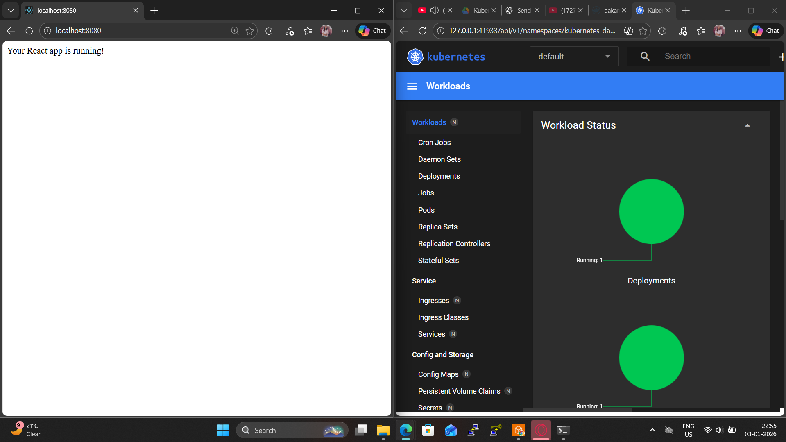
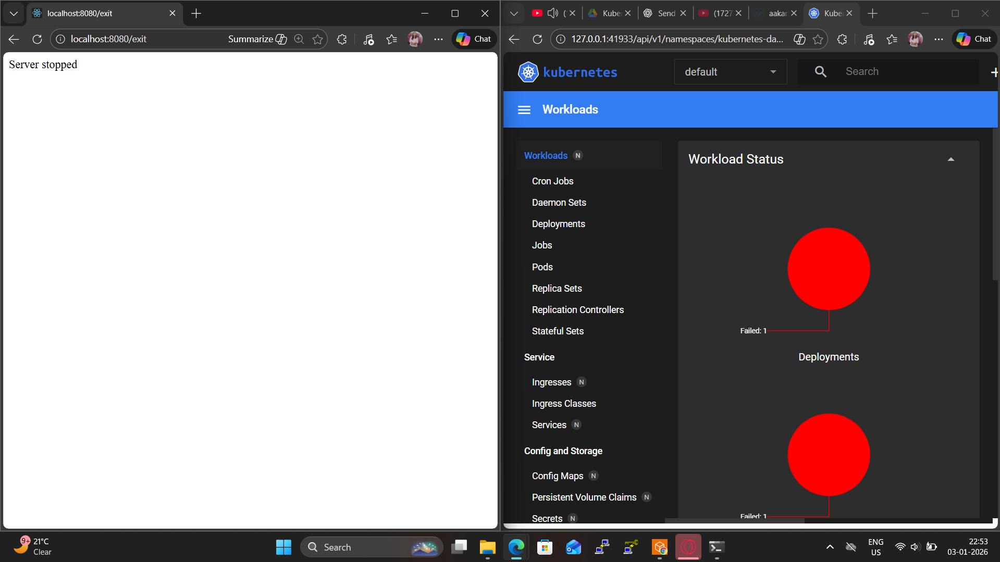
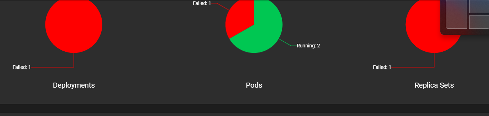

# Node-React K8s Docker App
This project is a full-stack application featuring a React frontend, containerized with Docker, and configured for deployment using Kubernetes (K8s).

## 🚀 Project Overview
This repository demonstrates a modern DevOps workflow for a React application:

Frontend: React.js

Containerization: Docker

Orchestration: Kubernetes (K8s)

## 📁 Project Structure
```

├── assets/             # Project images and static assets
├── k8s/                # Kubernetes manifest files (deployments, services)
├── public/             # Static public files for React
├── src/                # React source code
├── Dockerfile          # Docker configuration for containerizing the app
├── package.json        # Project dependencies and scripts
└── .gitignore          # Files to be excluded from Git
```
## 🛠️ Getting Started
### Prerequisites

To run this project, you will need:

1- Node.js 

2- Docker

3- Minikube or a Kubernetes cluster

4- kubectl

5- Local Development

### Clone the repository:
```
git clone https://github.com/aakansha113/node-react-k8s-docker-app.git
cd node-react-k8s-docker-app
```
### you can get this image on :
```
https://hub.docker.com/repository/docker/aakansha113/node-web-app/
 ```
### Install dependencies:
```
npm install
```
Run the app in development mode:

```
npm start
```
Open http://localhost:3000 to view it in the browser.

### 🐳 Dockerization
To build and run the application using Docker:

Build the Docker image:

```
docker build -t react-k8s-app .
```
Run the container:
```
docker run -p 3000:3000 react-k8s-app
```
### ☸️ Kubernetes Deployment
To deploy the application to a Kubernetes cluster:

Start your cluster (if using Minikube):
```
minikube start
```
Apply the Kubernetes configurations:
```
kubectl apply -f k8s
```
Check the status of pods and services:
```
kubectl get pods
kubectl get services
```
Access the app: If using Minikube, run:
```
minikube service <service-name>
```
## Application UI
## Webpage-
<p align="center">
  
</p>


<p align="center">
  
</p>

<p align="center">
  
</p>

###  🧪 Technologies Used
1-Frontend: React.js

2-Containerization: Docker

3-Orchestration: Kubernetes

4-Package Manager: npm


